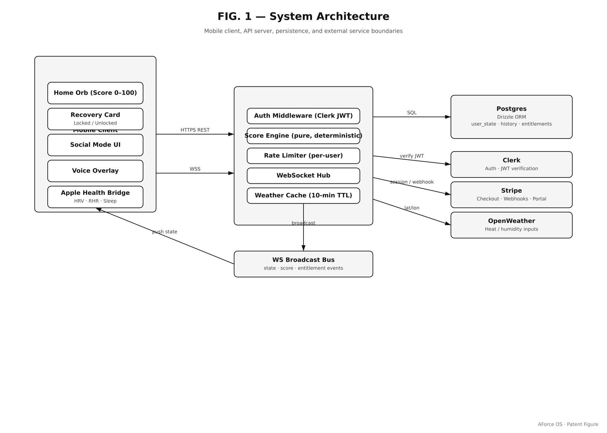
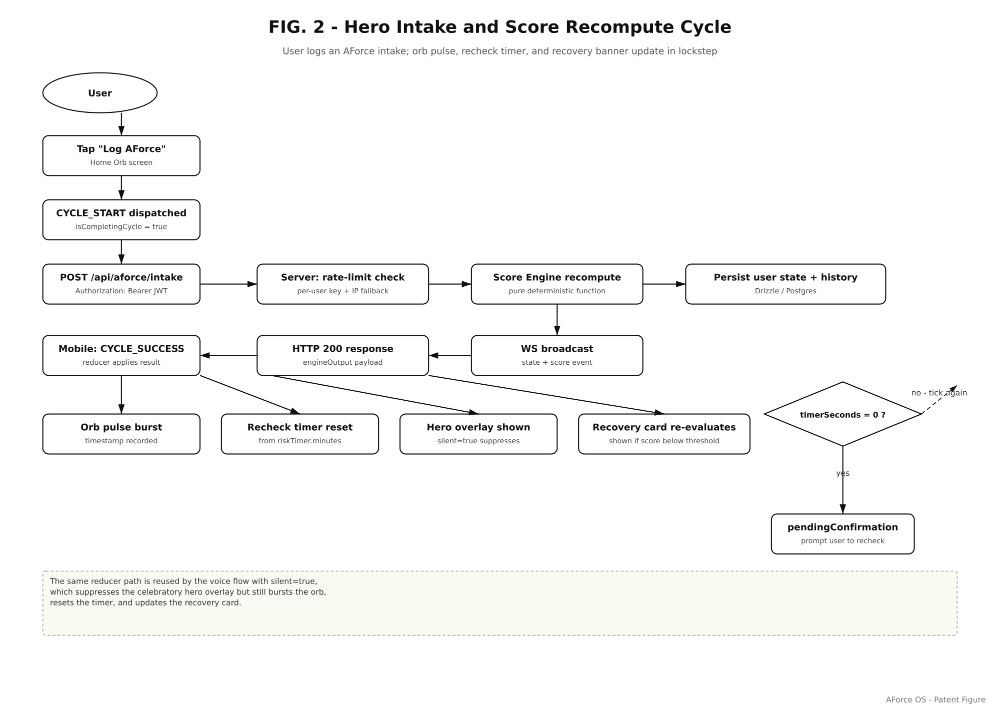
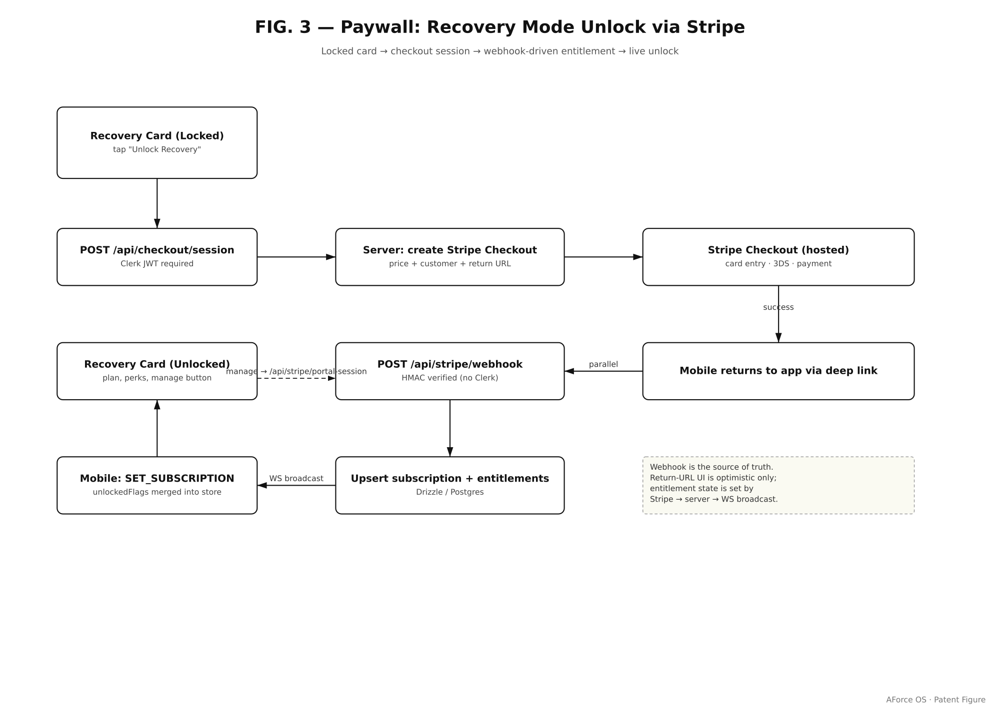
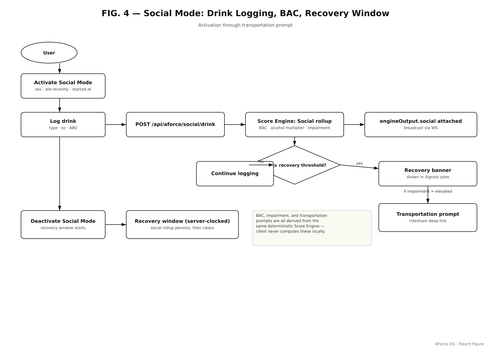
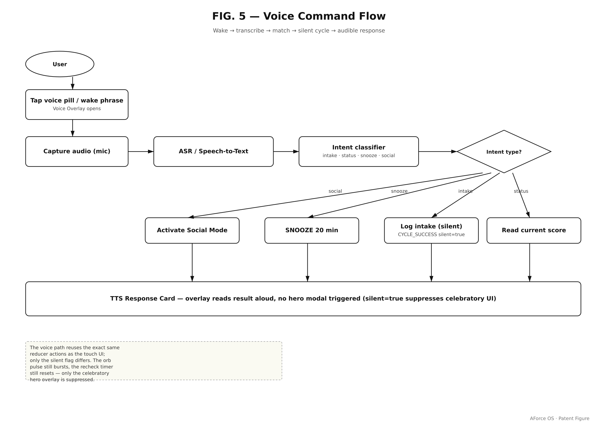
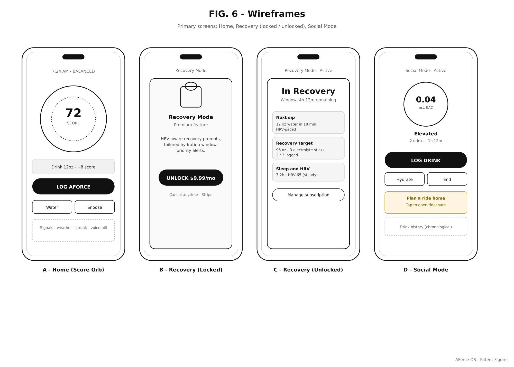
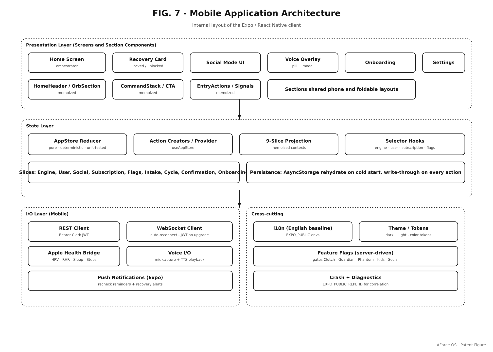
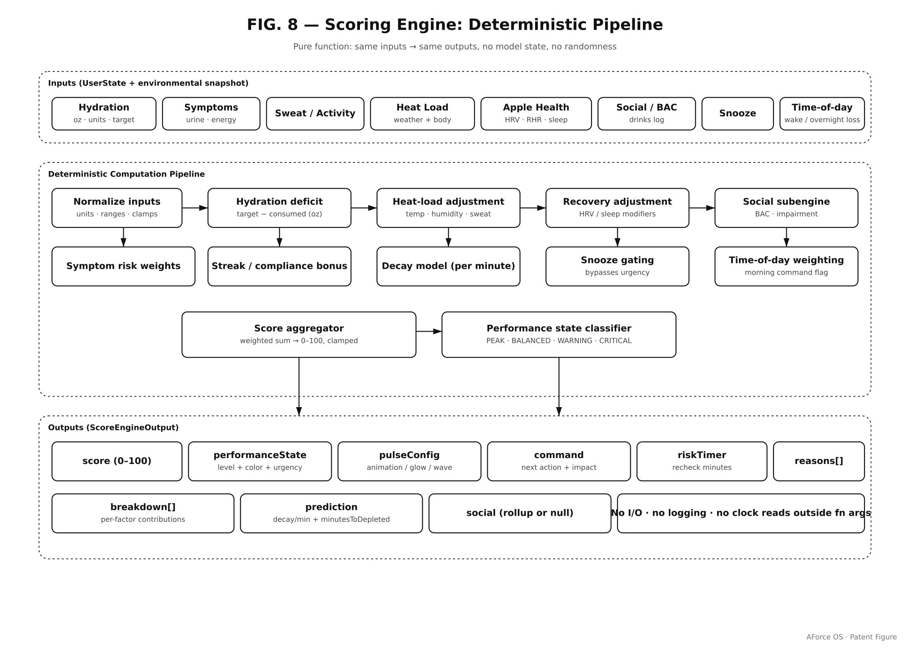
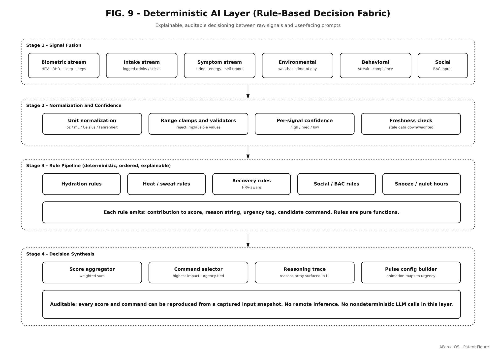
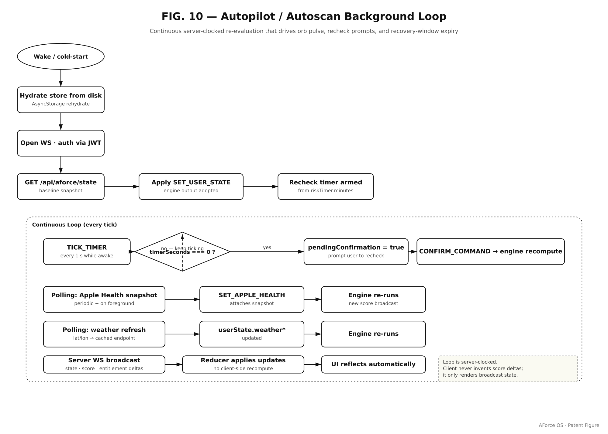

# AForce OS — Patent Figures (FIG. 1 – FIG. 10)

**Companion to:** `aforce-os-engineering-brief.md`
**Audience:** Outside counsel and USPTO filing
**Date:** April 29, 2026

This document reproduces the ten patent figures referenced throughout the engineering brief, in filing order, one figure per page, with a standardized caption block.

Each figure is also available as:

- **Vector SVG** — `fig{1..10}-*.svg` (editable, zero-loss)
- **High-resolution PNG** — `png/fig{1..10}-*.png` (2000 px wide, ~300 DPI at filing size)
- **Embedded inline** — at the matching section of the engineering brief

---

## FIG. 1 — System Architecture

**Maps to:** Brief §1 (Mobile Application)

*FIG. 1 — System Architecture. Top-level diagram of the AForce OS mobile client (Expo / React Native), the api-server (Express + Drizzle), the Postgres data store, and the WebSocket realtime channel that synchronizes state across devices.*

---

## FIG. 2 — Hero Intake Flow

**Maps to:** Brief §1.1 (home screen)

*FIG. 2 — Hero Intake Flow. The Hydration Control Center loop: animated status orb (band-coloured) → AI command (WHAT + WHEN + OUTCOME) → user logs intake (one tap or voice) → score recompute via the pure scoring engine → orb re-renders, prediction strip updates, recheck timer resets to the new cadence.*

---

## FIG. 3 — Paywall Flow

**Maps to:** Brief §1.4 (entitlement)

*FIG. 3 — Paywall Flow. Premium gating for Recovery Card, Sweat Calculator, Voice, Heat Guard, and Autoscan. The `useEntitlement` hook checks the persisted subscription flag and a server-confirmed entitlement; the locked variant of each component renders an in-context upsell that preserves the user's session state.*

---

## FIG. 4 — Social Mode Flow

**Maps to:** Brief §3.3 (Social Mode override)

*FIG. 4 — Social Mode Flow. Drink-logging panel → Widmark BAC estimate (parameterized by sex, weight, drinks, ABV, time elapsed, food intake) → impairment-level mapping (LOW / ELEVATED / MODERATE / HIGH / CRITICAL) → safety-class command override that preempts the standard performance ladder. Disclaimer copy is locked.*

---

## FIG. 5 — Voice Command Flow

**Maps to:** Brief §1.4 (voice)

*FIG. 5 — Voice Command Flow. Audio transcript → intent classification (LOG_INTAKE, GET_STATUS, GET_PREDICTION, START_SWEAT, OPEN_SCAN, …) → action dispatch into the same reducer that handles tap actions → spoken response rendered by the brand template engine. The voice surface is a pure UI on top of the same state machine — there are no voice-only branches.*

---

## FIG. 6 — Wireframes

**Maps to:** Brief §1.5 (wireframes)

*FIG. 6 — Wireframes. The five primary tabs of AForce OS — Hydration Control Center (home), Performance Signals (check), Recovery Protocol, Store, and Profile — plus the Sweat Calculator and Autoscan modal entry points. All wireframes are also available as live, interactive iframes on the engineering canvas.*

---

## FIG. 7 — Mobile App Architecture

**Maps to:** Brief §1.2 (state management)

*FIG. 7 — Mobile App Architecture. Sliced React Context + pure reducer + memoized slice projections so unrelated UI sections do not re-render on unrelated state changes. Expo-router file-based navigation. Clerk auth bridge mediates between Clerk session and the internal store. Apple HealthKit signals enter the engine through the `appleHealth` field of `UserState`.*

---

## FIG. 8 — Scoring Engine

**Maps to:** Brief §2 (Scoring Engine)

*FIG. 8 — Scoring Engine. Pure-function pipeline from `UserState` snapshot through (a) per-event absorption, (b) bounded contribution sum, (c) continuous decay model, to (d) score / band / breakdown / prediction / command. Server- and client-side execution produce identical output for identical input ("score identity invariant").*

---

## FIG. 9 — Deterministic AI Layer

**Maps to:** Brief §3 (Deterministic AI Layer)

*FIG. 9 — Deterministic AI Layer. Ordered rule pipeline: mode classification → penalty application → bonus application → decay projection → command generation → recheck cadence. No remote LLM inference in the safety- and performance-critical path; the same snapshot always produces the same command. Safety-class commands (Social Mode, Guardian Risk Engine) preempt the standard band ladder.*

---

## FIG. 10 — Autopilot / Autoscan

**Maps to:** Brief §4 (Autopilot) and §5 (Autoscan)

*FIG. 10 — Autopilot / Autoscan. Top half: sweat session → deficit % → autopilot cadence ladder (≥4 % → 8 min / critical, ≥2 % → 12 min / high, else → 20 min / moderate, 4 h window) → atomic state transition that simultaneously stores the autopilot tuple, resets the visible recheck timer, and clears any pending confirmation prompt. Bottom half: barcode / QR scan → product recognition (local catalog → Open Food Facts fallback) → live-state fit score → conditional AForce replacement decision when brand fit exceeds scanned fit by > 4 points.*

---

## Cross-reference

| Figure | Brief section | Implementation file(s) |
|---|---|---|
| FIG. 1 | §1 | `artifacts/aforce-os/`, `artifacts/api-server/` |
| FIG. 2 | §1.1 | `app/(tabs)/index.tsx`, `components/StatusPulseOrb.tsx` |
| FIG. 3 | §1.4 | `hooks/useEntitlement.ts`, `app/subscription.tsx` |
| FIG. 4 | §3.3 | `utils/scoringEngine.ts:458–531`, `services/bacEstimationService.ts` |
| FIG. 5 | §1.4 | `services/voiceService.ts`, `services/voiceTemplateEngine.ts` |
| FIG. 6 | §1.5 | live canvas iframes + `screens/*` |
| FIG. 7 | §1.2 | `app/_layout.tsx`, `store/useAppStore.tsx` |
| FIG. 8 | §2 | `utils/scoringEngine.ts`, `services/hydrationScoreService.ts` |
| FIG. 9 | §3 | `utils/scoringEngine.ts:537–591`, `:728–748`, `:790–838` |
| FIG. 10 | §4, §5 | `services/sweatRateEngine.ts:489–493`, `services/hydrationScanService.ts` |

---

*End of figures. Source vectors: `attached_assets/patent/fig{1..10}-*.svg`.*
